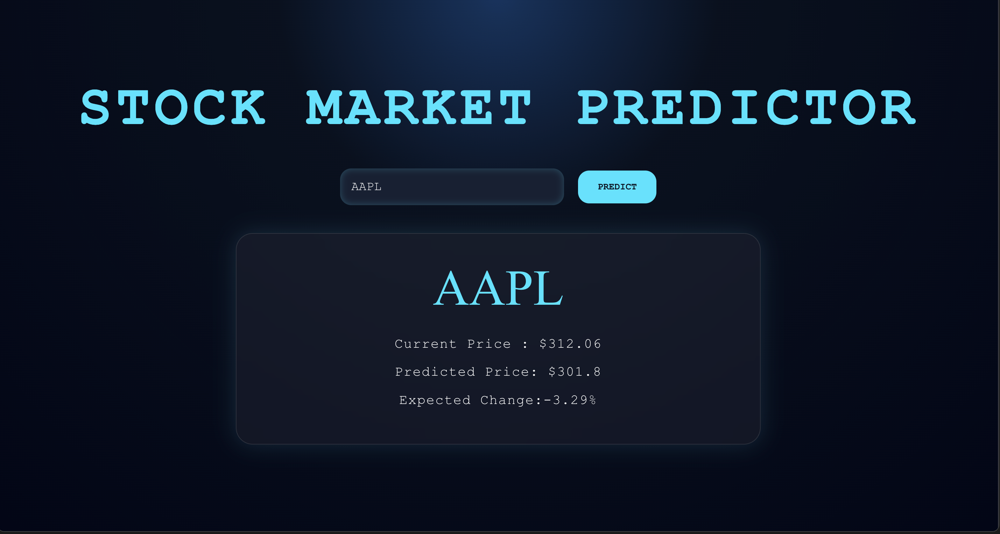
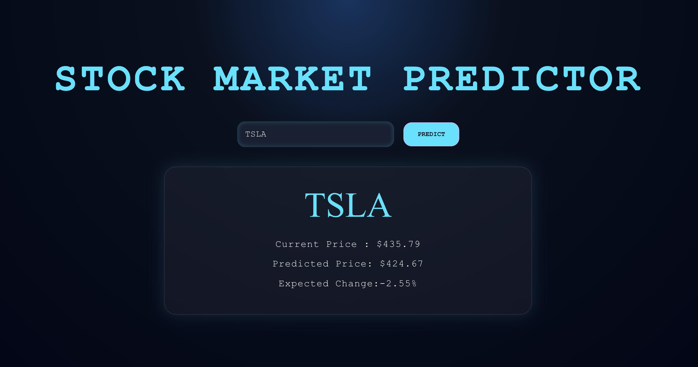

# 📈 Stock Market Predictor

An AI-powered stock forecasting platform built using **React**, **FastAPI**, **TensorFlow**, and **Yahoo Finance**.

## 🚀 Features

- Real-time stock data retrieval using Yahoo Finance
- LSTM Neural Network based stock price prediction
- FastAPI REST API backend
- Modern React frontend dashboard
- Current price and next-day prediction display
- Expected percentage change calculation
- Cyber-inspired UI design

## ⚙️ Tech Stack

- React + Vite
- FastAPI
- TensorFlow / Keras
- Scikit-learn
- NumPy
- Yahoo Finance

## 📸 Screenshots

### Home Page


### Prediction Example



### Tesla Prediction



## 🔄 Application Flow

```text
User Inputs Ticker
        ↓
React Frontend
        ↓
FastAPI Backend
        ↓
LSTM Model
        ↓
Prediction Returned
```

## 🔮 Future Improvements

- Support any stock ticker dynamically
- RSI / MACD indicators
- Interactive stock charts
- Prediction confidence scoring
- Model comparison