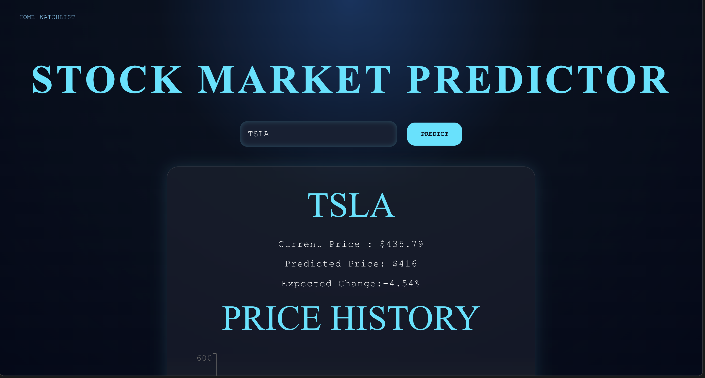
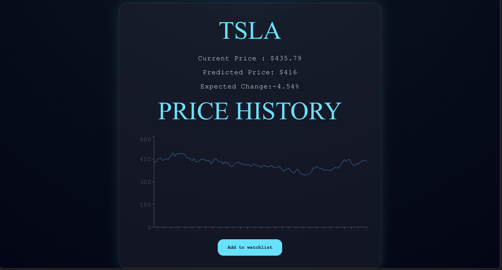
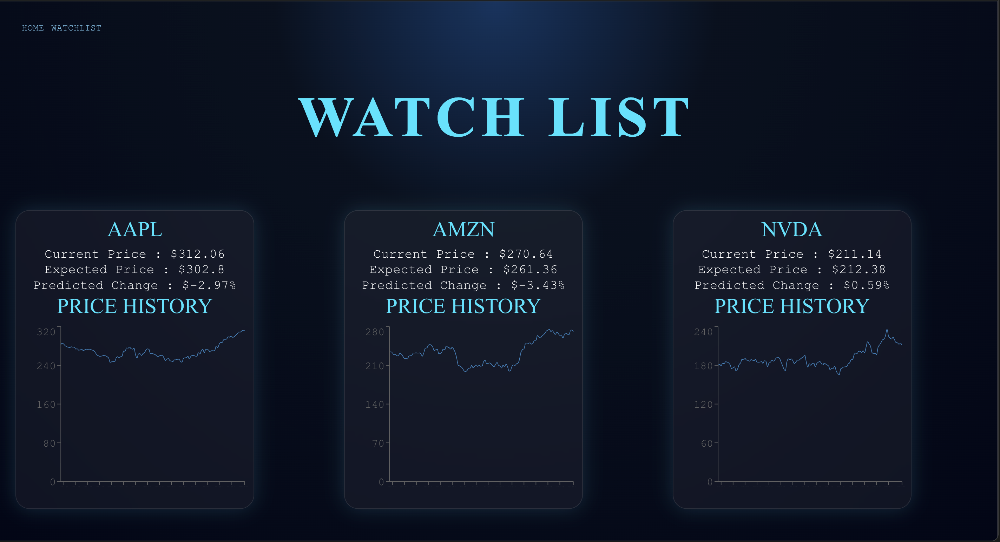

# 📈 Stock Market Predictor

An AI-powered stock forecasting platform that uses Long Short-Term Memory (LSTM) neural networks to analyze historical stock prices, generate future price predictions, and visualize market trends.

Built with **React**, **FastAPI**, **TensorFlow**, **Recharts**, and **Yahoo Finance**, the application dynamically trains models for new stock tickers, caches them locally, and provides an interactive dashboard with watchlist functionality.

---

## 🚀 Features

### AI Forecasting

* Dynamic stock ticker support
* Automatic model training for unseen stocks
* LSTM-based time series forecasting
* Current price prediction
* Predicted next-day closing price
* Expected percentage change calculation

### Data Visualization

* Interactive historical price charts
* Six months of historical market data
* Responsive chart rendering using Recharts
* Hover tooltips for price inspection

### Watchlist System

* Save favorite stocks to a personal watchlist
* Persistent storage using LocalStorage
* Watchlist dashboard with prediction summaries
* Historical chart preview for every saved stock

### User Experience

* Cyber-themed dashboard UI
* Error handling for invalid stock tickers
* Responsive component-based architecture
* Fast navigation using React Router

---

## 🧠 How It Works

1. User enters a stock ticker symbol

2. Backend checks whether a trained model already exists

3. If no model exists:

   * Historical stock data is downloaded from Yahoo Finance
   * Data is normalized using MinMaxScaler
   * An LSTM neural network is trained
   * Model and scaler are stored locally

4. Latest stock prices are retrieved

5. The trained model predicts the next closing price

6. Historical price data is fetched for chart visualization

7. Results are displayed in the React dashboard

---

## ⚙️ Tech Stack

### Frontend

* React
* Vite
* React Router
* Recharts
* CSS

### Backend

* FastAPI
* Uvicorn

### Machine Learning

* TensorFlow / Keras
* LSTM Neural Networks
* Scikit-learn
* NumPy

### Data Source

* Yahoo Finance (yfinance)

### Storage

* LocalStorage (Watchlist)
* Saved TensorFlow Models
* Saved Scalers

---

## 📂 Project Structure

```text
stock_predictor
│
├── backend
│   ├── app.py
│   │
│   ├── services
│   │   └── chart.py
│   │
│   └── ml
│       ├── train.py
│       ├── predict.py
│       ├── models/
│       └── scalers/
│
├── frontend
│   └── src
│       ├── components
│       │   ├── Navbar.jsx
│       │   ├── SearchBar.jsx
│       │   ├── TickerCard.jsx
│       │   ├── WishCard.jsx
│       │   ├── Chart.jsx
│       │   └── ErrorCard.jsx
│       │
│       ├── pages
│       │   ├── Homepage.jsx
│       │   └── Starred.jsx
│       │
│       └── App.jsx
│
├── ss
│   ├── home.png
│   ├── prediction.png
│   ├── chart.png
│   └── watchlist.png
│
└── README.md
```

---

## 🔄 Application Flow

```text
User Search
      ↓
React Frontend
      ↓
FastAPI API
      ↓
Model Exists?
   ↙       ↘
 Yes       No
  ↓         ↓
Predict   Train LSTM
  ↓         ↓
  └────┬────┘
       ↓
Fetch Chart Data
       ↓
Return Prediction
       ↓
Display Dashboard
```

---

## 📸 Screenshots

### Home Page



### Prediction Dashboard



### Watchlist Dashboard



---

## 🎯 Current Capabilities

* Predicts stock prices using LSTM neural networks
* Supports any valid Yahoo Finance ticker
* Trains models automatically on first request
* Caches trained models for future predictions
* Displays historical stock charts
* Stores user watchlists locally
* Provides prediction summaries and expected market movement

---

## 🔮 Future Improvements

* NSE/BSE stock support
* RSI and MACD indicators
* Confidence intervals
* Multiple forecasting models (LSTM, XGBoost, Random Forest)
* Watchlist performance tracking
* Portfolio analysis tools
* User authentication
* Cloud deployment
* Docker support
* Scheduled model retraining

---

## 👨‍💻 Author

Built as a full-stack machine learning project combining deep learning, financial forecasting, backend engineering, data visualization, and modern React development.
